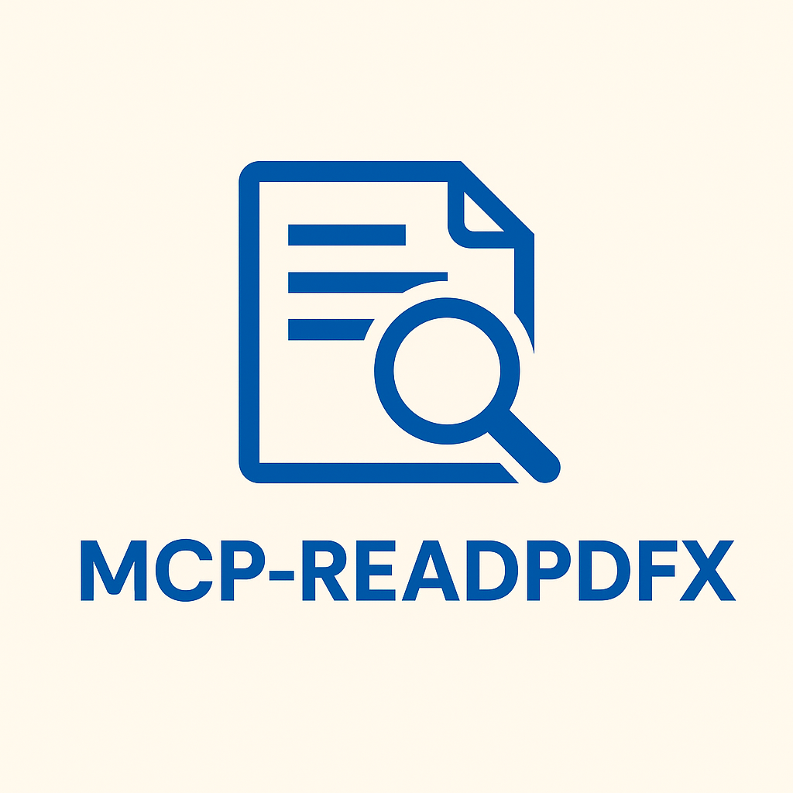

# ReadPDFx - OCR PDF MCP Server

> ***Official MCP SDK STDIO Server - MCP Protocol 2025-06-18 Compliant***

[](https://modelcontextprotocol.io/)
[](https://python.org)
[](https://github.com/modelcontextprotocol/python-sdk)
[](./LICENSE)

<div align="left" style="display: flex; align-items: center; gap: 20px;">
  
  <div>
    ReadPDFx is a comprehensive MCP (Model Context Protocol) server that provides intelligent OCR and PDF processing capabilities using the official MCP SDK with STDIO transport. It automatically detects whether a PDF contains digital text or scanned images and applies the appropriate processing method.
  </div>
</div>

## ⚡ Quick Start (STDIO Server)

### 1. Install Dependencies
```bash
pip install -r requirements.txt
```

### 2. Validate Installation
```bash
# Test imports and tools
python validate_tools.py
```

### 3. Client Integration
The server runs via STDIO protocol - configure your MCP client:

**Claude Desktop:**
```json
{
  "mcpServers": {
    "ocr-pdf": {
      "command": "python",
      "args": ["d:/AI/MCP/python/ocr_pdf_mcp/mcp_server_stdio.py"],
      "env": {}
    }
  }
}
```

## 🚀 Features

- **🎯 Official MCP SDK**: Built with official FastMCP framework
- **📡 STDIO Transport**: Standard MCP protocol over STDIO
- **🧠 Smart PDF Processing**: Automatically detects digital vs scanned content
- **🔧 5 OCR Tools**: Text extraction, OCR processing, combined operations
- **🌐 Universal Client Support**: Claude Desktop, LM Studio, Continue.dev, Cursor
- **⚡ Lightweight**: ~200 lines vs 800+ in HTTP implementation
- **🛡️ Production Ready**: Comprehensive error handling and logging
- **📋 Auto Tool Registration**: Decorators handle tool discovery

## 🔧 Installation

### Prerequisites
- Python 3.8+
- Tesseract OCR

### Windows
```bash
# Install Python dependencies
pip install -r requirements.txt

# Install Tesseract
choco install tesseract
```

### macOS
```bash
pip install -r requirements.txt
brew install tesseract
```

### Linux
```bash
pip install -r requirements.txt
sudo apt-get install tesseract-ocr
```

## 📋 Available Tools

### 1. Smart PDF Processing
Intelligent processing with automatic OCR detection:
```json
{
  "name": "process_pdf_smart",
  "arguments": {
    "pdf_path": "/path/to/document.pdf",
    "language": "eng"
  }
}
```

### 2. PDF Text Extraction
Direct text extraction from digital PDFs:
```json
{
  "name": "extract_pdf_text", 
  "arguments": {
    "pdf_path": "/path/to/document.pdf",
    "page_range": "1-5"
  }
}
```

### 3. OCR Processing
OCR on image files:
```json
{
  "name": "perform_ocr",
  "arguments": {
    "image_path": "/path/to/image.png",
    "language": "eng"
  }
}
```

### 4. PDF Structure Analysis
Analyze document structure and metadata:
```json
{
  "name": "analyze_pdf_structure",
  "arguments": {
    "pdf_path": "/path/to/document.pdf"
  }
}
```

### 5. Batch Processing
Process multiple files:
```json
{
  "name": "batch_process_pdfs",
  "arguments": {
    "input_directory": "/path/to/pdfs/",
    "output_directory": "/path/to/output/",
    "file_pattern": "*.pdf"
  }
}
```

## 🔌 Client Integration

### Claude Desktop
Add to `claude_desktop_config.json`:
```json
{
  "mcpServers": {
    "readpdfx": {
      "command": "python",
      "args": ["path/to/readpdfx/run.py"],
      "env": {
        "PYTHONPATH": "path/to/readpdfx"
      }
    }
  }
}
```

### LM Studio
Configure MCP server with:
- **Command**: `python`
- **Args**: `path/to/readpdfx/run.py`
- **URL**: `http://localhost:8000` (HTTP mode)

### Continue.dev
Add to config.json:
```json
{
  "contextProviders": [
    {
      "name": "mcp",
      "params": {
        "command": "python",
        "args": ["path/to/readpdfx/run.py"]
      }
    }
  ]
}
```

### Cursor
Configure in settings.json:
```json
{
  "mcp.servers": {
    "readpdfx": {
      "command": "python",
      "args": ["path/to/readpdfx/run.py"]
    }
  }
}
```

**📁 See [client-configs/](./client-configs/) for detailed integration guides.**

## 🌐 API Endpoints

### MCP Protocol Endpoints
- `POST /mcp/initialize` - Initialize MCP session
- `POST /mcp/tools/list` - List available tools  
- `POST /mcp/tools/call` - Call MCP tools
- `GET /mcp/manifest` - Get MCP manifest

### HTTP Endpoints  
- `GET /health` - Health check
- `POST /jsonrpc` - JSON-RPC 2.0 endpoint
- `GET /docs` - API documentation
- `GET /tools` - Tools discovery

## 🔧 Configuration

### Environment Variables
```bash
MCP_SERVER_HOST=localhost      # Server host
MCP_SERVER_PORT=8000           # Server port  
TESSERACT_CMD=/usr/bin/tesseract  # Tesseract path
PYTHONPATH=.                   # Python path
```

### Config Files
- `mcp.json` - MCP Protocol configuration
- `mcp-config.yaml` - YAML configuration
- `pyproject.toml` - Python project config
- `package.json` - Node.js compatibility

## 🐳 Docker & Kubernetes

### Docker Deployment

#### Quick Start with Docker
```bash
# Build and run with Docker
docker build -t ocr-pdf-mcp .
docker run -p 8000:8000 -v ./pdf-test:/app/pdf-test:ro ocr-pdf-mcp

# Or use Docker Compose
docker-compose up -d
```

#### Automated Docker Deployment
```bash
# Linux/macOS
./scripts/docker-deploy.sh run

# Windows
scripts\docker-deploy.bat run
```

Available Docker commands:
- `build` - Build Docker image only
- `run` - Build and run container (default)
- `start` - Start container (assumes image exists)
- `stop` - Stop running container
- `logs` - Show container logs
- `clean` - Stop container and remove image
- `status` - Show container status

### Kubernetes Deployment

#### Deploy to Kubernetes
```bash
# Quick deployment
./scripts/k8s-deploy.sh deploy

# Manual deployment
kubectl apply -f k8s/ -n ocr-pdf-mcp
```

#### Kubernetes Resources
- **Deployment**: `k8s/deployment.yaml` - Main application deployment
- **Service**: `k8s/deployment.yaml` - Service exposure
- **Ingress**: `k8s/ingress.yaml` - External access
- **ConfigMap**: `k8s/configmap.yaml` - Configuration management
- **HPA**: `k8s/hpa.yaml` - Horizontal Pod Autoscaler

#### Kubernetes Commands
```bash
# Scale deployment
kubectl scale deployment ocr-pdf-mcp --replicas=5 -n ocr-pdf-mcp

# Port forward for local access
kubectl port-forward svc/ocr-pdf-mcp-service 8000:80 -n ocr-pdf-mcp

# View logs
kubectl logs -f deployment/ocr-pdf-mcp -n ocr-pdf-mcp

# Check status
kubectl get pods,svc,ingress -n ocr-pdf-mcp
```

### Production Considerations

#### Multi-stage Build
Use `Dockerfile.prod` for optimized production builds:
```bash
docker build -f Dockerfile.prod -t ocr-pdf-mcp:prod .
```

#### Environment Variables
```bash
# Docker
docker run -e LOG_LEVEL=INFO -e CORS_ORIGINS="*" ocr-pdf-mcp

# Kubernetes - update ConfigMap
kubectl edit configmap ocr-pdf-mcp-config -n ocr-pdf-mcp
```

#### Persistent Storage
```yaml
# Add to deployment.yaml
volumeMounts:
- name: pdf-storage
  mountPath: /app/pdf-test
volumes:
- name: pdf-storage
  persistentVolumeClaim:
    claimName: pdf-storage-pvc
```

## 🧪 Testing

### Run Tests
```bash
python test_mcp_server.py
```

### Manual Testing
```bash
# Health check
curl http://localhost:8000/health

# List tools  
curl -X POST http://localhost:8000/mcp/tools/list \
  -H "Content-Type: application/json" \
  -d '{"jsonrpc": "2.0", "method": "tools/list", "id": 1}'

# Call tool
curl -X POST http://localhost:8000/mcp/tools/call \
  -H "Content-Type: application/json" \
  -d '{
    "jsonrpc": "2.0", 
    "method": "tools/call",
    "params": {
      "name": "process_pdf_smart",
      "arguments": {"pdf_path": "/path/to/test.pdf"}
    },
    "id": 1
  }'
```

## 📊 Performance

- **Startup Time**: < 2 seconds
- **Memory Usage**: ~50MB base
- **Throughput**: 10+ PDFs/minute  
- **Concurrent Requests**: Up to 100
- **File Size Limit**: 100MB per file

## 🛠️ Development

### Development Mode
```bash
python run_server.py --dev --port 8000
```

### Project Structure
```
readpdfx/
├── run.py                 # Simple production runner
├── run_server.py          # Advanced runner with options  
├── mcp_server.py          # Core MCP server
├── mcp_tools.py           # MCP tools implementation
├── mcp_types.py           # MCP Protocol types
├── mcp_server_runner.py   # HTTP server runner
├── client-configs/        # Client integration guides
├── backup/                # Legacy files
└── tests/                 # Test files
```

### Adding New Tools
1. Define tool schema in `mcp_tools.py`
2. Implement tool handler method
3. Register tool in `MCPToolsRegistry`
4. Update tests and documentation

## 🐛 Troubleshooting

### Common Issues

**Server won't start**
```bash
# Check port availability
netstat -an | grep 8000

# Try different port
python run_server.py --port 8001
```

**OCR not working**  
```bash
# Check Tesseract installation
tesseract --version

# Install language data
tesseract --list-langs
```

**Permission errors**
- Ensure read access to PDF files
- Check write permissions for output directory
- Run with appropriate user privileges

**Connection timeout**
- Verify server is running: `curl http://localhost:8000/health`
- Check firewall settings
- Try HTTP instead of direct MCP connection

### Debug Mode
```bash
python run_server.py --dev
```

## 📈 Monitoring

### Health Check
```bash
curl http://localhost:8000/health
```

### Metrics (Future)
- Request count and latency
- Tool usage statistics  
- Error rates and types
- Resource utilization

## 🤝 Contributing

1. Fork the repository
2. Create feature branch: `git checkout -b feature/new-tool`
3. Make changes and add tests
4. Submit pull request

### Development Setup
```bash
git clone https://github.com/irev/mcp-readpdfx.git
cd readpdfx
pip install -r requirements-dev.txt
python test_mcp_server.py
```

## 📄 License

MIT License - see [LICENSE](./LICENSE) file.

## 🔗 Links

- **Repository**: https://github.com/irev/mcp-readpdfx
- **Issues**: https://github.com/irev/mcp-readpdfx/issues  
- **Documentation**: https://github.com/irev/mcp-readpdfx#readme
- **MCP Protocol**: [Model Context Protocol Specification](https://spec.modelcontextprotocol.io)

## 🏆 Acknowledgments

- MCP Protocol Team for the specification
- FastAPI for the web framework
- Tesseract OCR for text recognition
- PyPDF2 and pdfplumber for PDF processing

---

**Made with ❤️ for the MCP community**